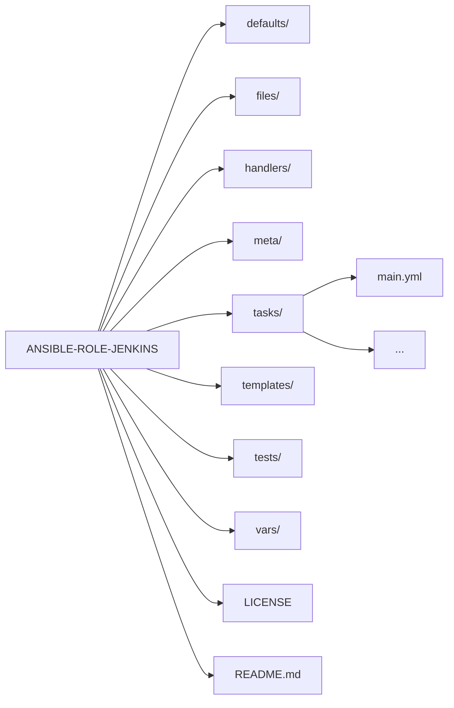

Jenkins Server Setup
=========

This Ansible Role automates the setup and configuration of a Jenkins server on an Ubuntu machine. It installs and configures various components required for a fully operational CI/CD environment.

Requirements
------------

- Ansible 2.16 or higher installed on the control node.
- An Ubuntu server with `sudo` privileges.

How to Use
------------
1. Clone this repository to your Ansible roles directory:
    ```bash
    git clone <repository_url> ansible-role-jenkins
    ```

2. Add this role to your playbook:
    ```yaml
    - hosts: jenkins_servers
      become: yes
      roles:
        - role: ansible-role-jenkins
          vars:
            jenkins_plugins:
              - git
              - pipeline
            ssl_domain: your.domain.com
    ```

3. Run the playbook:
    ```bash
    ansible-playbook -i inventory playbook.yml
    ```

File Structure
------------


Variables
------------
Key variables you can override in your playbook:
- `jenkins_plugins`: List of Jenkins plugins to install.
- `ssl_domain`: Domain name for SSL certificate generation.

Directories
------------
The following is a breakdown of the key files and directories in this role:

- **`defaults/`**: Contains default variables used in the role.
- **`files/`**: Includes static files required for configuration.
- **`handlers/`**: Contains handlers triggered by task notifications, such as restarting services.
- **`meta/`**: Defines metadata about the role, such as dependencies.
- **`templates/`**: Stores Jinja2 templates for dynamic file generation.
- **`tests/`**: Includes test playbooks for validating the role.
- **`vars/`**: Contains role-specific variables.

Role Variables
--------------

A description of the settable variables for this role should go here, including any variables that are in defaults/main.yml, vars/main.yml, and any variables that can/should be set via parameters to the role. Any variables that are read from other roles and/or the global scope (ie. hostvars, group vars, etc.) should be mentioned here as well.

Tasks
--------------
The main functionality is divided into specific task files for modularity:
- **`install_certbot.yml`**: Installs Certbot and generates SSL certificates.
- **`install_docker.yml`**: Installs Docker and Docker CLI for containerized environments.
- **`install_dotnet.yml`**: Installs the .NET SDK and tools like `dotnet-ef`.
- **`install_jdk.yml`**: Installs OpenJDK required for Jenkins.
- **`install_jenkins_plugins.yml`**: Installs Jenkins plugins using the Plugin Installation Manager.
- **`install_nginx.yml`**: Installs and configures Nginx as a reverse proxy for Jenkins.
- **`install_nodeJs.yml`**: Installs Node.js for JavaScript-based tooling.
- **`setup_Ubuntu.yml`**: Prepares the Ubuntu environment by installing essential packages.
- **`settings.yml`**: Configures environment-specific settings.
- **`main.yml`**: The entry point for executing all tasks in this role.

Dependencies
------------

A list of other roles hosted on Galaxy should go here, plus any details in regards to parameters that may need to be set for other roles, or variables that are used from other roles.

Example Playbook
----------------

Including an example of how to use your role (for instance, with variables passed in as parameters) is always nice for users too:

    - hosts: servers
      roles:
         - { role: username.rolename, x: 42 }

License
-------

This role is licensed under the Apache 2.0 License. See the `LICENSE` file for details.

Author Information
------------------

Developed by [Mark](https://github.com/markma85). Contributions are welcome!
